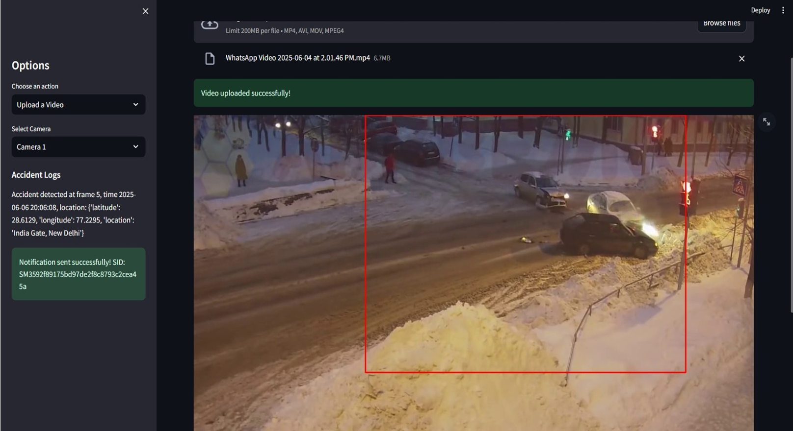
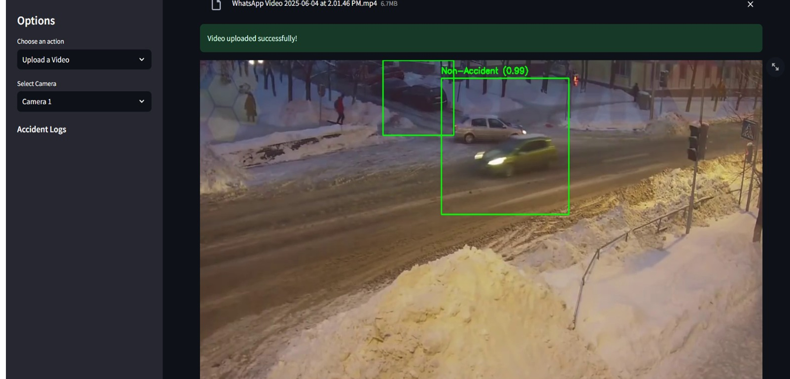
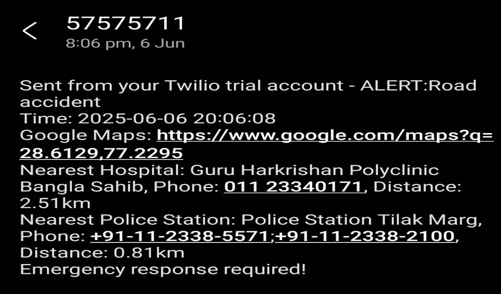

# 🚦 Real-Time Accident Detection System using YOLO & CNN

## 📚 Project Description
This system detects accidents in real-time from CCTV surveillance video using deep learning techniques. It uses **YOLO** for object detection and **CNN** for accident classification, and automatically sends alerts (with location, time, and snapshot) to emergency services for fast response.

---

## 🎯 Objectives
- Detect accidents accurately in surveillance footage.
- Extract Regions of Interest (ROIs) using YOLO.
- Classify accident vs non-accident using a CNN model.
- Automatically send alerts to emergency services upon accident detection.

---

## ⚙️ How It Works
1. Extract video frames from the CCTV feed.
2. Detect vehicles and pedestrians using YOLO.
3. Extract Regions of Interest (ROIs) where accidents are likely.
4. Classify ROIs using CNN as accident or no accident.
5. If accident is detected:
    - Log time and location.
    - Save accident snapshot.
    - Send notification alert to emergency services.

---

## 🛠️ Technologies Used
- Python  
- OpenCV  
- face_recognition  
- YOLO  
- Convolutional Neural Networks (CNN)  
- NumPy  
- Pandas  
- Tkinter (for GUI)  
- Openpyxl (for Excel manipulation)
